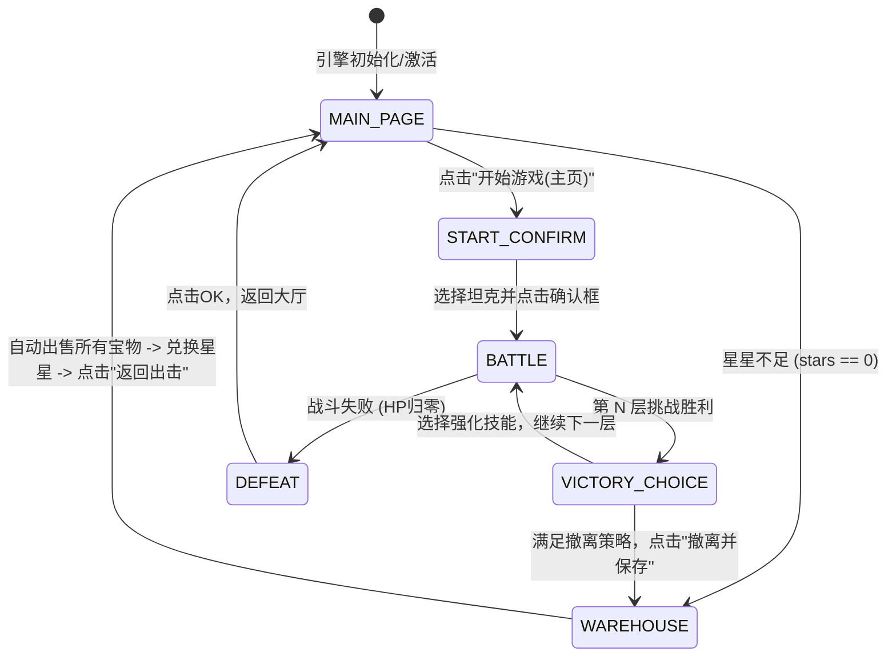

# AgenTank Raid Helper — 项目概览与 AI 助手开发指南

本文件是专为 AI 编码助手准备的快速导览文档，旨在帮助您以最快速度理解项目架构、DOM 元素选择器、状态机流转和核心游戏逻辑。

---

## 🎯 项目基本信息

*   **项目名称**：AgenTank Raid Helper (坦克出击 Raid 助手)
*   **平台**：Chrome Extension (MV3 浏览器插件)
*   **目标页面**：`https://agentank.ai/raid`
*   **核心功能**：实现全自动出击、智能坦克选择、智能选择强化技能、智能战术撤离、自动仓库出售宝物和星屑兑换星星的无限循环挂机。
*   **终极目标**：智能挂机上王者，胜率达到 55% 以上。
*   **开发语言规范**：与用户的所有交流沟通、代码中的所有注释及文档编写**通通必须使用中文**。

---

## 🛠️ 技术栈与文件结构

```
agentraid/
├── manifest.json       # 插件配置文件 (MV3, 版本号 2.1.2)
├── content.js          # 核心自动化状态机引擎 (注入页面的脚本)
├── popup.html          # 插件仪表盘面板 UI
├── popup.js            # 仪表盘数据同步与控制逻辑
├── popup.css           # 仪表盘微动动画与暗色玻璃拟态样式
├── CHANGELOG.md        # 版本演进历史管理
└── GEMINI.md          # 本文档
```

---

## ⚡ 核心自动化状态机 (State Machine)

`content.js` 采用高内聚、自适应频率的**六状态状态机**进行控制流管理：



---

## 🔍 DOM 元素选择与容错设计

由于页面上的部分元素在动态渲染时会**丢失 ID**，因此在 `content.js` 中使用了 **混合选择器 (ID + Class + 文本过滤)** 策略，具有极强的鲁棒性：

| 页面对应元素 | 首选选择器 | 容错 Fallback 选择器 | 说明 |
| :--- | :--- | :--- | :--- |
| **星星余额** | `$('#raidHeaderStarBalance')` | - | 动态展示星星数量 |
| **星屑余额** | `$('#raidHeaderDustBalance')` | - | 兑换星星的原料 |
| **主页开始游戏** | `$('#raidStartBtn')` | `document.querySelector('.raid-home-start')` | 主页面的出击按钮，真实 DOM 无 ID |
| **打开仓库** | `$('#raidWarehouseBtn')` | `document.querySelector('.raid-home-view .raid-secondary')` 或查找包含"打开仓库"文本的按钮 | 进入仓库流程的入口，真实 DOM 无 ID |
| **开始确认弹框** | `$('#raidStartModal')` | `document.querySelector('#raidStartModal')` | 坦克选择与出击确认弹框 |
| **确认框中开始按钮** | `$('#raidStartConfirmBtn')` | 查找文本包含 "开始游戏" 或 "进入地图" 的按钮 | 确认并扣星进入地图 |
| **选择强化/结算弹框** | `$('#raidRewardModal')` | - | 包含层数胜利选强化及战败确定按钮的唯一弹框 |
| **失败确认/OK按钮** | `$('#raidLossConfirmBtn')` | 查找文本包含 "确定" 或 "OK" 的按钮 | 失败后的确认按钮 |
| **撤离并保存** | `$('#raidEscapeBtn')` | 查找文本包含 "撤离并保存" 的按钮 | 撤退并存盘结算 |
| **返回出击 (仓库中)** | - | 查找文本 "返回出击" 或 `.raid-warehouse-back` | 返回大厅 |
| **兑换星星输入框** | `$('#raidExchangeStarsInput')` | `document.querySelector('.raid-warehouse-view input')` | 仓库中指定兑换星星数 |

---

## 🧠 智能决策算法

### 1. 战术撤离策略 (Evacuation Strategy)
根据 `remark.md` 的规范，通过记录当前胜场及拥有的复活命数进行低风险收益最大化评估：
*   **≤ 3 层**：无条件**继续**（必须先选技能，累积初始战斗力）。
*   **3 层挑战完成后**：若此时拥有的 `备用核心 == 0`，则在第三层结算时**撤离并保存**；若 `备用核心 >= 1`，则**继续**挑战到第 5 层。
*   **5 层挑战完成后**：若拥有的 `备用核心 < 2`，则在第五层结算时**撤离并保存**；若 `备用核心 >= 2`，则**继续**挑战到第 7 层。
*   **>= 7 层**：挑战完成后**无条件撤离并保存**（保守锁分策略）。

### 2. 强化技能选择策略 (Upgrade Priority)
当胜利并出现三选一技能时：
1.  **绝对第一优先级**：`备用核心`（只要有且未满 Lv.2，必选它）。
2.  **首次拥有优先**：其他核心技能未获得过的（Lv.0），优先各获得一次：
    *   `自动护盾`、`宝物磁场`、`技能冷却`、`开局推进`
3.  **均已拥有时的二次升级顺序**：
    *   `自动护盾` > `宝物磁场` > `技能冷却` > `开局推进`

### 3. 仓库自动出售与兑换
*   **出售宝物**：扫描当前仓库页面所有按钮，识别含有 `"全部出售"` 或 `"出售"` 的按钮自动依次点击，直到全部清空。
*   **星星兑换**：当 `星星 == 0` 且 `星屑 > 0` 时，自动在输入框填入 `"1"`，并点击 `"兑换星星"` 按钮（防止一次性把所有星屑兑换成星星，按需兑换，降低星屑持有风险）。

---

## ⚠️ 避坑指南与已修历史

1.  **Extension Context Invalidated (上下文失效)**：
    *   *起因*：当插件在 `chrome://extensions` 中被重新加载或更新时，已经在旧页面中运行的 `content.js` 定时器仍然在轮询并调用 Chrome api，导致控制台崩溃报错。
    *   *方案*：在所有 API 调用前加入 `isContextValid()` 检查。一旦检测到 `chrome.runtime.id` 不存在，旧定时器**立即 return 并终止 loop 循环**，实现无感平滑销毁。
2.  **点击事件穿透与假死**：
    *   *方案*：`safeClick` 中集成了完整的事件序列触发：`mouseover` -> `mousedown` -> `mouseup` -> `click`，以欺骗前端虚拟 DOM 并触发实际点击。
    *   *冷却锁*：主页出击点击增加 5 秒冷却标志位，防止因接口网络延迟引发的连点报错。

---

## 📝 AI 助手研发与质量控制流程（核心严谨度规范）

为了确保插件的稳定运行与零报错，所有承接任务前后的 AI 助手必须强制执行以下规范，绝不允许马虎折腾：

1. **全自动升级版本号规则**：
   - **每次任何细微的代码、配置、样式甚至文档修改，都必须将插件版本号（Version）递增 +1**。
   - 修改版本号时必须在以下文件中同步更新，保持全局一致：
     - `manifest.json` 中的 `"version"`
     - `content.js` 头部注释和侧边栏 HTML 的 `<div class="version-tag">`
     - `popup.html` 的 `<div class="version-tag">`
     - `CHANGELOG.md` 顶部的版本演进历史
     - `GEMINI.md` 中提及的版本号描述

2. **重构严谨性审查规范**：
   - **重构函数或变量时**：如将异步函数重构为同步函数、或修改函数的返回参数及签名，**必须立即在整个项目中进行全局搜索**，逐一检查该函数在所有地方的调用点。
   - **同步清理所有调用点**：必须同步修改调用点的语法（如清理遗留的 `.then()`、`.catch()`、`await`），绝对不允许漏掉任何一处，从而杜绝抛出 `TypeError` 导致状态机死锁的低级错误。
   - **代码修改前的完整性保障**：每次提 PR/Commit 前必须自己先做一次逻辑串联审查，特别是状态机的入口、主循环 `startLoop` 和挂载生命周期处的完整逻辑流。

---

*若后续有任何架构调整，请同步修改本文件，以便后继 AI 助手无缝接单开发。*
